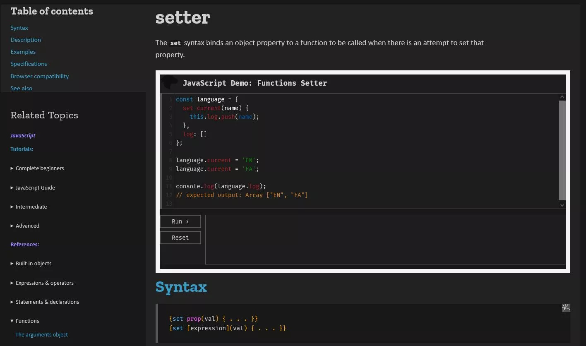

# MDN Docs dark theme

This is my __work in progress__ dark theme for the [MDN Web Docs](https://developer.mozilla.org/en-US/) website.

## How To Use

TLDR; Install a user-styles browser add-on eg [Stylus](https://github.com/openstyles/stylus) to apply the user stylesheet over an existing website stylesheet.

### Stylus brower add-on

- https://github.com/openstyles/stylus
- links to Firefox, Chrome and Opera add-on

### CSS

- https://userstyles.world/style/2809/mdn-web-docs-dark-theme